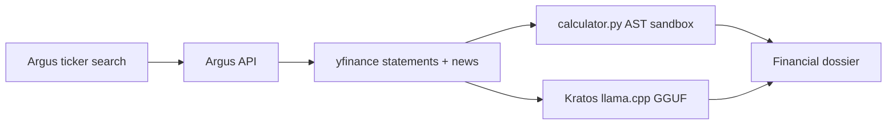

# Argus-Kratos

Autonomous financial intelligence with live Yahoo Finance ingestion, sandboxed AST math, and local quantized sentiment inference on Apple Silicon.



## Run

```bash
source venv/bin/activate
pip install -r requirements.txt
python app.py
```

Open http://127.0.0.1:8080 and enter any Yahoo Finance-supported ticker. The API is available at `/api/health`, `/api/dossier?ticker=TSLA`, and `/api/stream?ticker=TSLA`.

The local GGUF is optional for the web server. When present, Kratos classifies live headlines with llama.cpp and Apple Metal; without it, the API remains usable with a neutral fallback.

In another terminal, run the Rich terminal presentation:

```bash
python kratos_cli.py
```

The repository intentionally ignores `*.gguf`; place the model at `llama-3.2-1b-instruct.Q4_K_M.gguf` locally.
