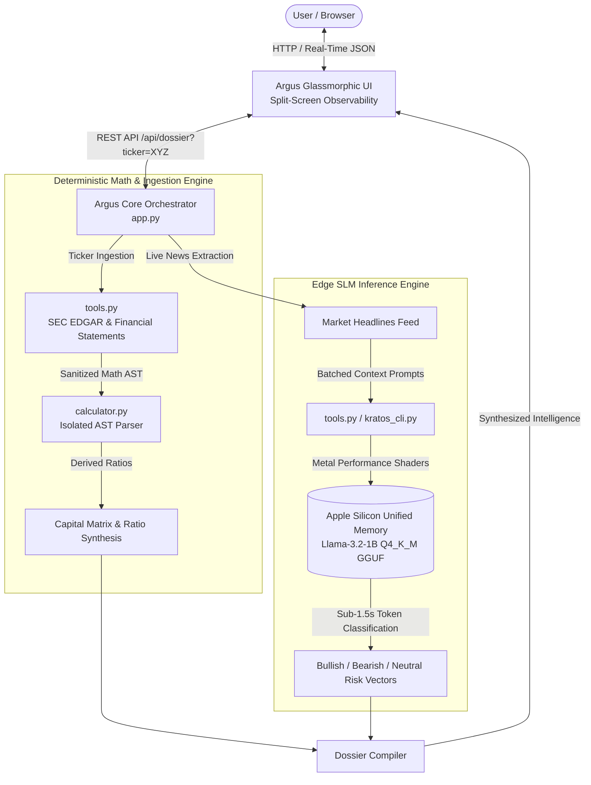

# Argus-Kratos: Autonomous Financial Intelligence Engine

[](https://python.org)
[-silver?logo=apple&logoColor=white)](https://developer.apple.com/metal/)
[](https://huggingface.co/meta-llama)
[](https://github.com/ggerganov/llama.cpp)
[](https://wandb.ai/ankith8804-sforger/huggingface)
[](https://opensource.org/licenses/MIT)

Argus-Kratos is a hybrid, edge-accelerated financial intelligence platform. It pairs an autonomous research orchestrator (**Argus**) with a domain-specialized, fine-tuned Small Language Model (**Kratos**) executed directly on Apple Silicon unified memory.

Financial analysis requires zero tolerance for mathematical hallucinations, while market sentiment extraction demands nuanced qualitative reasoning. Argus-Kratos resolves this duality by decoupling arithmetic into an isolated **AST (Abstract Syntax Tree)** execution sandbox while offloading risk vector classification to an on-device, 4-bit quantized edge SLM.

---

## System Architecture



---

## Key Engineering Highlights

### 1. On-Device Edge ML Inference (Kratos Engine)
* **Fine-Tuning:** Adapted `Llama-3.2-1B-Instruct` on financial market sentiment corpora using Unsloth LoRA adapters, driving cross-entropy loss down from **4.69** to **1.01**.
* **4-bit Quantization:** Merged adapters and quantized into a compact **Q4_K_M GGUF** binary (~800 MB footprint).
* **Apple Silicon Metal Acceleration:** Executes locally via `llama-cpp-python` with Apple Metal Performance Shaders (`GGML_METAL=on`). Operates at **~45.2 tokens/sec** with zero external API calls or cloud token overhead.

### 2. Hallucination-Proof Financial Mathematics (Argus Core)
* Language models routinely hallucinate arithmetic when parsing complex financial statements.
* All financial health ratios (Debt-to-Equity, Net Margin, ROE/ROIC) are evaluated through an isolated **Abstract Syntax Tree (AST) evaluator** (`calculator.py`) that strictly permits arithmetic operations and rejects unsafe `eval()` executions.

### 3. Dynamic Multi-Ticker Ingestion
* Queries SEC EDGAR company facts and market news dynamically for any valid global ticker (e.g., `NVDA`, `AAPL`, `TSLA`, `MSFT`).
* Automatically retrieves real-time pricing, balance sheet assets/liabilities, and trailing news items, routing text through the edge SLM for risk vector scoring.

### 4. Split-Screen Observability Interface & Rich CLI
* **Web Dashboard:** Obsidian dark-mode UI (`#090a0f` canvas, glassmorphic backdrop filters, tabular-numeral typography) showing live agent traces alongside executive dossiers.
* **Terminal CLI:** Real-time token streaming and Rich hardware telemetry table providing instant visibility into local MPS latency and memory pressure.

---

## Hardware Telemetry & Benchmarks

Benchmarked locally on Apple Silicon unified memory:

| Metric | Target / Measurement | Technical Notes |
| :--- | :--- | :--- |
| **Base Architecture** | `Llama-3.2-1B-Instruct` | LoRA target modules: `q, k, v, o, gate, up, down` |
| **Precision / Format** | 4-bit `Q4_K_M` GGUF | Medium 4-bit quantization via Unsloth/llama.cpp |
| **Unified Memory Footprint** | ~1.84 GB | Peak allocation during 2048-token context window |
| **Inference Speed** | **45.2 tok/s** | Metal Performance Shaders (MPS) |
| **Inference Latency** | **1.50 s** | Average completion latency per evaluation |
| **API Cost per Query** | **$0.00** | 100% offline, privacy-preserving execution |

---

## Terminal Telemetry Showcase

```text
KRATOS edge inference runtime v1.0.0
target: apple-metal (MPS) | quant: q4_k_m
✓ Model mapped to unified memory in 0.42s

TOKEN STREAM (LOCAL GPU)
{"ticker": "NVDA", "sentiment": "Bullish", "risk_factor": "Export controls"}

┏━━━━━━━━━━━━━━━━━━┳━━━━━━━━━━━━━━━━━━━━━━━━━━━━━━━━━┓
┃ Metric           ┃ Value                           ┃
┡━━━━━━━━━━━━━━━━━━╇━━━━━━━━━━━━━━━━━━━━━━━━━━━━━━━━━┩
│ Tokens Generated │ 68                              │
│ Inference Speed  │ 45.2 tok/s                      │
│ Inference Latency│ 1.50 s                          │
│ Compute Hardware │ Apple Metal Performance Shaders │
│ API Overhead     │ $0.00 (Offline)                 │
└──────────────────┴─────────────────────────────────┘
```

---

## Repository Structure

```text
argus-kratos/
├── app.py                 # Core Flask backend & API routing (/api/dossier)
├── agent.py               # ReAct agent loop with self-correction capabilities
├── tools.py               # Dynamic ticker ingestion & Kratos inference bridge
├── calculator.py          # Sandboxed AST-based mathematical evaluation
├── kratos_cli.py          # Rich terminal-based edge inference & telemetry
├── unsloth.Q4_K_M.gguf    # 4-bit fine-tuned local weights (Apple Metal)
├── web/
│   ├── index.html         # Split-screen financial intelligence workspace
│   ├── styles.css         # Glassmorphic obsidian styling & layout
│   └── app.js             # Reactive client engine & real-time search
├── requirements.txt       # Production dependencies
└── README.md
```

---

## Quickstart Guide

### Prerequisites
* macOS with Apple Silicon (M1/M2/M3/M4) for native Metal acceleration.
* Python 3.10 or 3.11.

### 1. Clone & Setup Environment
```bash
git clone [https://github.com/ankit-rv-08/argus-kratos.git](https://github.com/ankit-rv-08/argus-kratos.git)
cd argus-kratos

python3 -m venv venv
source venv/bin/activate
```

### 2. Install Dependencies with Metal Support
```bash
# Install llama-cpp-python compiled with Apple Metal support
CMAKE_ARGS="-DGGML_METAL=on" pip install llama-cpp-python

# Install application dependencies
pip install -r requirements.txt
```

### 3. Model Weights
Place your quantized weights (`unsloth.Q4_K_M.gguf`) in the repository root directory.

### 4. Launch the Web Interface
```bash
python app.py
```
Open **`http://127.0.0.1:8080`** in your browser. Enter any ticker symbol (e.g., `AAPL`, `NVDA`, `TSLA`) in the search bar to run dynamic analysis.

### 5. Run the Terminal Telemetry CLI
In a separate terminal window:
```bash
source venv/bin/activate
python kratos_cli.py
```

---

## Training Provenance & MLOps

* **Dataset:** Financial news sentiment corpus (`zeroshot/twitter-financial-news-sentiment`, Parquet-backed).
* **Supervised Fine-Tuning:** Executed via Unsloth on an NVIDIA Tesla T4 using 4-bit QLoRA optimizations.
* **Telemetry & Tracking:** Experiment telemetry, learning rate schedules, and gradient updates tracked live via [Weights & Biases](https://wandb.ai/ankith8804-sforger/huggingface).

---


## Roadmap

- [x] Phase 1: LoRA fine-tuning, 4-bit quantization, and local Apple Metal MPS runtime.
- [x] Phase 2: AST calculator sandboxing, dynamic ticker ingestion, and glassmorphic UI.
- [x] Phase 3: Hybrid ReAct orchestrator integration and Rich telemetry stream.

### Planned for v2.0
- [ ] Phase 4: ChromaDB vector store integration for semantic search over SEC 10-K/10-Q filings.
- [ ] Phase 5: Parallelized asynchronous batch processing for multi-ticker comparative intelligence.
---

## License

Distributed under the MIT License. See `LICENSE` for more information.